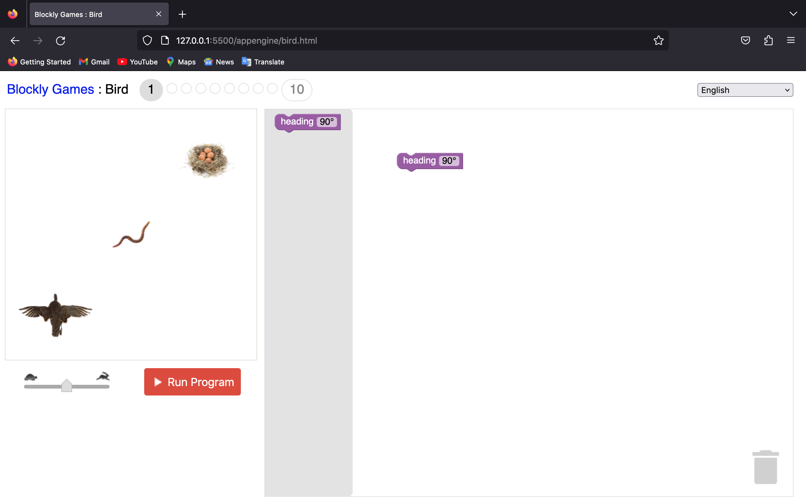
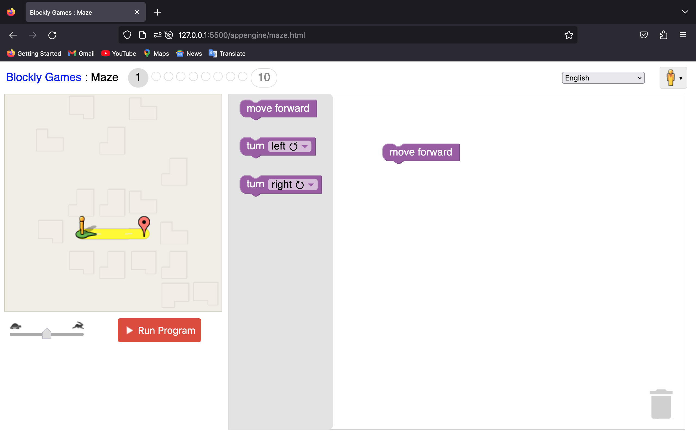

Google's Blockly Games is a series of educational games that teach programming.
It is based on the [Blockly](https://developers.google.com/blockly/) library.
All code is free and open source.

**The games are available at https://blockly.games/**

**The developer's site is at https://github.com/google/blockly-games/wiki**

## Steps

### 1. Installation
1. Forking the `Blockly Games` repository into the user's GitHub account.
2. Installing `Blockly Games` from the GitHub repository.
3. Setting up game dependencies on macOS using `Homebrew` and `MacPorts`.
4. Installing game dependencies using `make deps` and running the `make games` command.
5. Checked, revised, and updated each sample to use "python3" initially using "python" in `./Makefile` file.
6. Installing the `git-conventional-commits` package to the repository and included the `git-conventional-commits.yaml` file.

### 2. Coding
1. Add the following CSS3 styles to the end of the files `./appengine/bird/style.css` and `./appengine/maze/style.css`, insert the code below:

```css
.sliderTrack {
  stroke: #aaa;
  stroke-width: 6px;
  stroke-linecap: round;
}

.sliderKnob {
  fill: #ddd;
  stroke: #bbc;
  stroke-width: 1px;
  stroke-linejoin: round;
}
```
2. Add new variable into the `./appengine/bird/main.js`, `speedSlider`, and implemented the `calculateSpeed` function. This function `calculateSpeed` computes a value using specific calculations and assigns it to the `stepSpeed` variable.
3. Add the Slider SVG icon into the `./appengine/bird/html.js` file.
4. Require Slider into the `bird` and `maze`.
5. Add new variable into the `./appengine/maze/main.js`, `speedSlider`, and implemented the `calculateSpeed` function. This function `calculateSpeed` computes a value using specific calculations and assigns it to the `stepSpeed` variable.
6. Add the Slider SVG icon into the `./appengine/maze/html.js` file.

### 3. Execute Game

